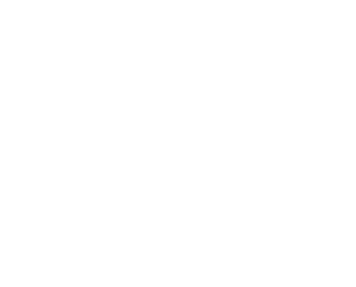

<p align="center">
  <a href="https://blu3.in"></a>
</p>
<h1 align="center">Blu3 - music rooms</h1>

<p align="center">
<a href="https://x.com/onebluwish" target="_blank"></a>

<a href="https://blu3.in"></a>
</p>

<div align="center">
  <a href="https://blu3.in">Website</a>
  <span>&nbsp;&nbsp;•&nbsp;&nbsp;</span>
  <a href="https://github.com/xrealblue/blu3">GitHub</a>
  <span>&nbsp;&nbsp;•&nbsp;&nbsp;</span>
  <a href="https://x.com/onebluwish">Twitter</a>
  <span>&nbsp;&nbsp;•&nbsp;&nbsp;</span>
  <a href="https://github.com/xrealblue/blu3/issues/new">Issues</a>
  <br />
</div>

### [Try it live →](https://blu3.in)

## What is Blu3?

Blu3 is a real-time collaborative music listening platform. Create rooms, queue songs, and listen together with synchronized playback. It's built as a **non-commercial, student-built educational project**.

This repository contains the **open-source frontend client** — a Next.js application that powers the entire user interface. The backend server (`blu3-server`) is **not open source**.

```bash
bun run dev        # start the development server
bun run build      # build for production
bun run start      # start the production server
```

## Features

- **Real-time sync** — Listen together with perfectly synchronized playback
- **Music rooms** — Create or join rooms with a shareable invite code
- **Multi-source search** — Search and play from YouTube & JioSaavn
- **In-app chat** — Real-time messaging with GIF support
- **Collaborative queue** — Add, remove, reorder tracks together
- **Playlists** — Create, save, and share your favorite collections
- **Desktop app** — Cross-platform Electron app with auto-update
- **No ads, no tracking** — Completely free, no cookies, no analytics

## Tech Stack

| | |
|---|---|
| **Framework** | Next.js (React 19) |
| **Language** | TypeScript |
| **Styling** | Tailwind CSS v4 |
| **Player** | YouTube IFrame API + Tone.js |
| **Auth** | Better Auth (Google OAuth) |
| **Desktop** | Electron |
| **Runtime** | Bun |

## Install

> **Prerequisites:** [Bun](https://bun.sh) and a running instance of `blu3-server`.

```sh
git clone https://github.com/xrealblue/blu3.git
cd blu3/blu3-client
bun install
```

### Configure

Create a `.env.local` file based on the variables below:

```
NEXT_PUBLIC_API_URL     URL of the blu3-server instance (default: http://localhost:8000)
NEXT_PUBLIC_WS_URL      WebSocket URL for real-time events
NEXT_PUBLIC_APP_URL     Public-facing URL of the client
```

### Run

```sh
bun run dev
```

Open [http://localhost:3000](http://localhost:3000).

### Build for production

```sh
bun run build
bun run start
```

### Desktop (Electron)

```sh
bun run desktop:dev       # development mode
bun run desktop:build     # package installer
```

## Project Structure

```
blu3-client/
├── electron/              # Electron desktop shell
├── public/
│   └── logo/              # Brand assets
├── src/
│   ├── app/               # Next.js pages & layouts
│   ├── components/        # UI components
│   │   └── Player/        # Player & room components
│   ├── hooks/             # React hooks
│   ├── lib/               # Client libraries
│   └── utils/             # Helpers & types
├── AGENTS.md
├── METADATA.json
├── TERMS.md
└── LICENSE
```

## Contributing

This is a student-built educational project. Contributions, issues, and feature requests are welcome. Feel free to open an issue or submit a pull request.

## License

Custom Non-Commercial Educational License — see [LICENSE](./LICENSE) for details.
